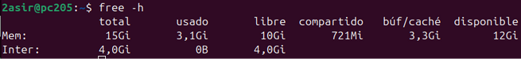
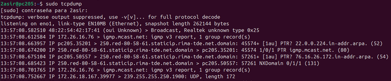

# Monitorización
Listar los procesos que se estan ejecutando en el sistema

Lista mas detallada de los procesos que hay en ejecucion en tu usuario

Lista mas detallada de los procesos que hay en ejecucion en todos los usuarios

Listar los procesos en ejecucion sobre un programa en especifico en nuestro caso nano

Listar de manera mas detalla los procesos de un programa en especifico

Listar los 5 procesos que mas CPU consumen

Ejecuta el comando top que sirve para ver los procesos y lo guarda en un archivo txt y con el cat podemos visualizar el archivo

Listar los 10 procesos que mas CPU consumen durante 3 segundos

Sirve para mostrar los registros de actividad en este caso guardados en un archivo

Crear un archivo ver su proceso y matar el proceso

Muestra informacion sobre la memoria del sistema

Muestra informacion sobre la memoria del sistema pero de manera mas legible

Muestra el estado de la memoria del sistema de manera repetida con intervalos de 3 segundos

Muestra el uso del sistema de archivos de manera legible

Muestra informacion del espacio en disco de la raiz

Muestra en tamaño total de un directorio o archivo en mi caso he probado con raiz y home

Muestra el tamaño de los directorios que hay en nuestro caso dentro de /home

Muestra estadisticas sobre el rendimiento de los dispositivos de entrada y salida

Muestra las estadisticas mas detalladas sobre un dispositivo en concreto

Muestra las estadisticas mas detalladas sobre un dispositivo en concreto y la actualiza cada 5 segundos

Captura y analiza paquetes

Captura los paquetes de red de una interfaz

